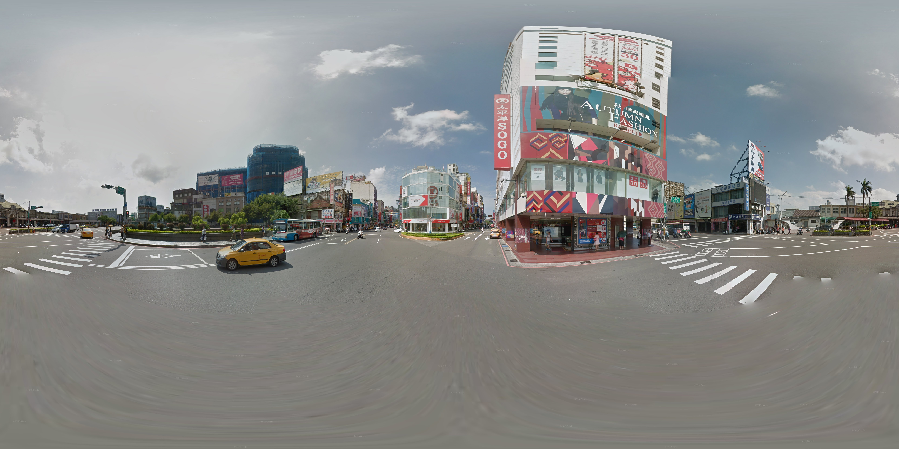
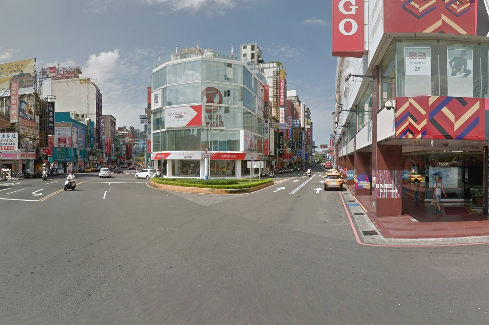

# Equirec2Perspec
## Introduction
<strong>Equirec2Perspec</strong> is a python tool to split equirectangular panorama into normal perspective view.
<strong>convert.py</strong> is the main file to compile and run.

## Panorama
Given single or multiple inputs of 360 degree panorama image/s
<center></center>

## Perpective
Split panorama into perspective view with given parameters
<center></center>

## Usage
```python
import os
import cv2 
import Equirec2Perspec as E2P 

if __name__ == '__main__':
    equ = E2P.Equirectangular('src/image.jpg')    # Load equirectangular image
    
    #
    # FOV unit is degree 
    # theta is z-axis angle(right direction is positive, left direction is negative)
    # phi is y-axis angle(up direction positive, down direction negative)
    # height and width is output image dimension 
    #
    #FOV of the wanted image
    FOV = 110
    #width and height of wanted image
    width = 1440
    height = 1080

    #number of camera turns horizontally and vertically
    num_horizontal = 8
    num_vertical = 2

    #Counter for image numbering
    image_counter = 0

    theta_step = 45 #angle value of moving right horizontally
    phi_step = 30 #angle value of moving up vertically

    num_frames = 356 #Enter the number of images here


    #img = equ.GetPerspective(60, 0, 0, 720, 1080) # Specify parameters(FOV, theta_step, phi_step, height, width)
```

